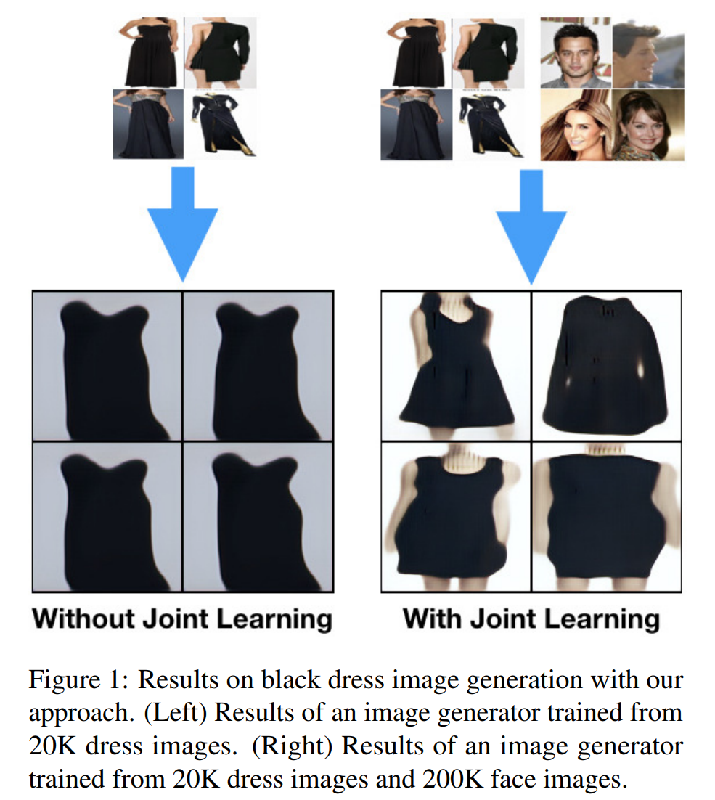

# Joint-Learning-of-NN



## Requirements

- Python 2.7
- TensorFlow >= 1.2rc0
- Numpy
- Tensorflow slim library [https://github.com/tensorflow/models/tree/master/research/slim] (for inception v3 architecture, you can use custom built network architecture if you have one)

## Content

- `images.py`: Script to run the training process.
- `utils.py`: Utility functions.
- `datagenerator.py`: Contains a wrapper class for the new input pipeline.
- `images/*`: contains some teaser images from the paper.

## Usage

All you need to touch is the `images.py`. You can configure different parameters in there. You have to provide `.txt` files to the script (`exp_1_train.txt`, `exp_2_train.txt`, .... and `exp_1_test.txt`, `exp_2_test.txt`, .... for different datasets. In the paper, I used five datasets.) Each of them list the complete path to your train/val images together with the class number in the following structure.

```
Example train.txt:
/path/to/train/image1.png 0
/path/to/train/image2.png 1
/path/to/train/image3.png 2
/path/to/train/image4.png 0
.
.
```
were the first column is the path and the second the class label.

In the paper and in the current training script, I used five datasets:
1. [Caltech-UCSD Birds 200](http://www.vision.caltech.edu/visipedia/CUB-200.html)
2. [Stanford Dogs Dataset](http://vision.stanford.edu/aditya86/ImageNetDogs/)
3. [Flower Datasets](http://www.robots.ox.ac.uk/~vgg/data/flowers/)
4. [Cars Dataset](https://ai.stanford.edu/~jkrause/cars/car_dataset.html)
5. [FGVC-Aircraft Benchmark](http://www.robots.ox.ac.uk/~vgg/data/fgvc-aircraft/)